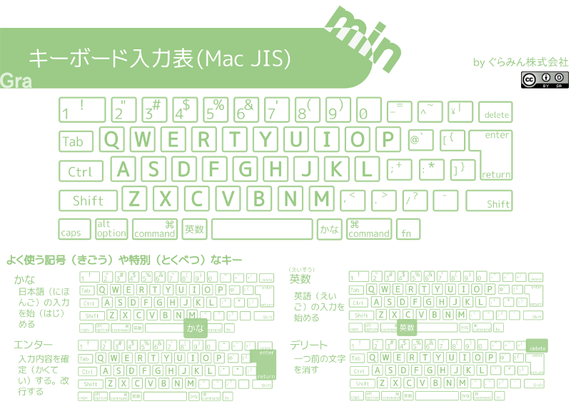

+++
showonlyimage = false
draft = false
image = "img/portfolio/キーボード入力表_mac.png"
date = "2016-11-05T18:25:22+05:30"
title = "キーボード入力表（Mac 向け）"
weight = 0
+++
Mac で使われるキーボードのキーの一覧と特殊なキーの簡単な説明です。
<!--more-->

### pdf 形式
[キーボード入力表_mac.pdf](https://github.com/gramin-programming/kids-programming-resource/blob/master/%E3%82%AD%E3%83%BC%E3%83%9B%E3%82%99%E3%83%BC%E3%83%88%E3%82%99%E5%85%A5%E5%8A%9B%E8%A1%A8_mac.pdf "キーボード入力表_mac.pdf")

### svg 形式

[キーボード入力表.svg](https://github.com/gramin-programming/kids-programming-resource/blob/master/%E3%82%AD%E3%83%BC%E3%83%9B%E3%82%99%E3%83%BC%E3%83%88%E3%82%99%E5%85%A5%E5%8A%9B%E8%A1%A8.svg "キーボード入力表.svg")

### ライセンス

[BY SA について](https://creativecommons.org/licenses/by-sa/4.0/deed.ja)
