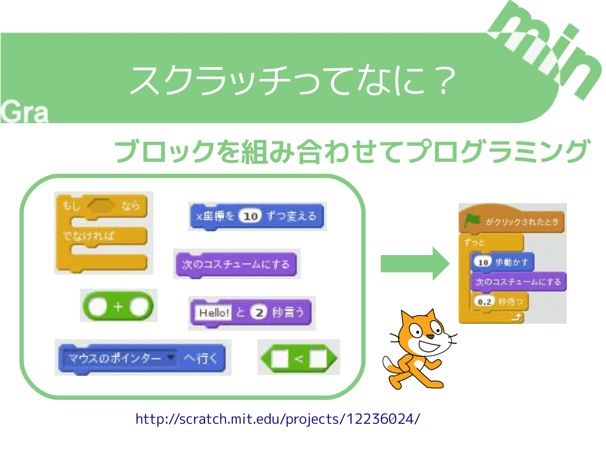

+++
draft = false
showonlyimage = false

image = "img/lets-start-scratch.png"
date = "2016-11-05T18:25:22+05:30"
title = "スクラッチをはじめよう"

weight = 1
archives = ["2016/11"]
tags = [
  "Scratch",
]
+++
<a href='https://scratch.mit.edu/'>Scratch</a> ってなに？、画面の紹介、チュートリアル（ダンスしよう）、作品の保存方法、作品を開く方法を紹介します。これは Scratch バージョン 1.4 の時のものになります。
<!--more-->

### pdf 形式
[スクラッチをはじめよう_scratch1.4.pdf](https://github.com/gramin-programming/kids-programming-resource/blob/master/%E3%82%B9%E3%82%AF%E3%83%A9%E3%83%83%E3%83%81%E3%82%AF%E3%83%A9%E3%83%95%E3%82%99/%E3%82%B9%E3%82%AF%E3%83%A9%E3%83%83%E3%83%81%E3%82%92%E3%81%AF%E3%81%97%E3%82%99%E3%82%81%E3%82%88%E3%81%86_scratch1.4.pdf "スクラッチをはじめよう_scratch1.4.pdf")

### odp 形式
[スクラッチをはじめよう_scratch1.4.odp](https://github.com/gramin-programming/kids-programming-resource/blob/master/%E3%82%B9%E3%82%AF%E3%83%A9%E3%83%83%E3%83%81%E3%82%AF%E3%83%A9%E3%83%95%E3%82%99/%E3%82%B9%E3%82%AF%E3%83%A9%E3%83%83%E3%83%81%E3%82%92%E3%81%AF%E3%81%97%E3%82%99%E3%82%81%E3%82%88%E3%81%86_scratch1.4.odp "スクラッチをはじめよう_scratch1.4.odp")

### ライセンス

[BY ND について](https://creativecommons.org/licenses/by-nd/4.0/deed.ja)
