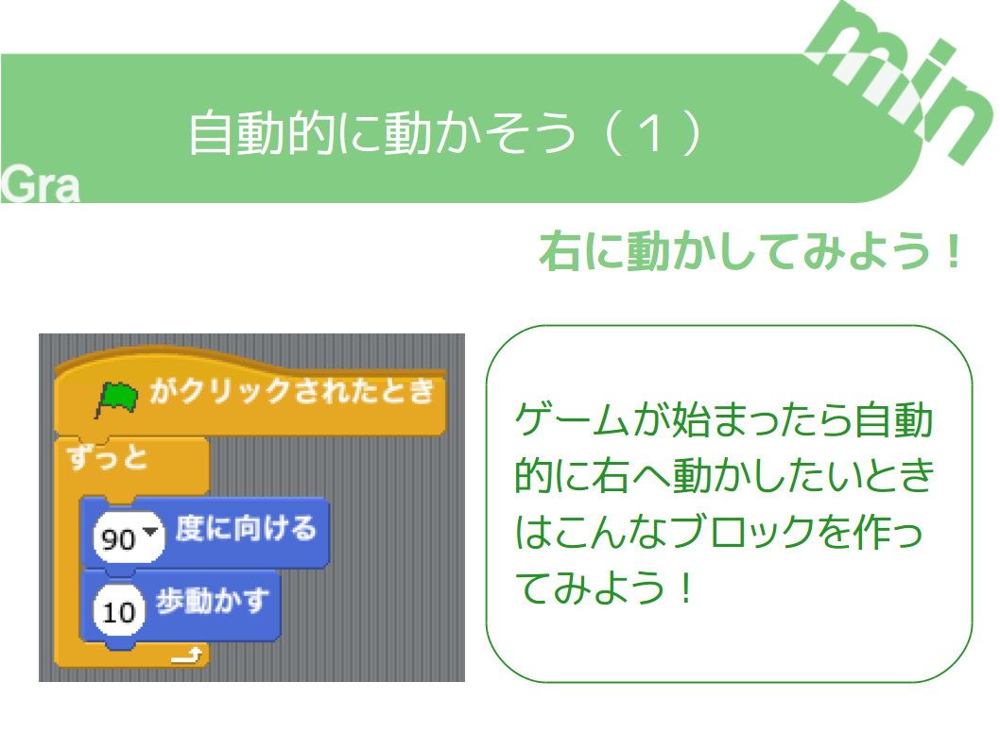

+++
draft = false
showonlyimage = false

image = "img/ref-move-auto.png"
date = "2016-11-05T18:25:22+05:30"
title = "自動的に動かそう"

weight = 1
archives = ["2016/11"]
tags = [
  "Scratch",
  "作り方",
]
+++
小学校におじゃました時やオンラインスクラッチクラスで授業をするときに使う資料（しりょう）です。

背景（はいけい）を作る方法をまとめました。
<!--more-->

### pdf 形式
[自動的に動かそう.pdf](https://github.com/gramin-programming/kids-programming-resource/blob/master/%E3%82%B9%E3%82%AF%E3%83%A9%E3%83%83%E3%83%81%E3%82%AF%E3%83%A9%E3%83%95%E3%82%99/%E3%83%92%E3%83%B3%E3%83%88/%E8%87%AA%E5%8B%95%E7%9A%84%E3%81%AB%E5%8B%95%E3%81%8B%E3%81%9D%E3%81%86.pdf)

### odp 形式
[自動的に動かそう.odp](https://github.com/gramin-programming/kids-programming-resource/blob/master/%E3%82%B9%E3%82%AF%E3%83%A9%E3%83%83%E3%83%81%E3%82%AF%E3%83%A9%E3%83%95%E3%82%99/%E3%83%92%E3%83%B3%E3%83%88/%E8%87%AA%E5%8B%95%E7%9A%84%E3%81%AB%E5%8B%95%E3%81%8B%E3%81%9D%E3%81%86.odp)

### ライセンス

[BY ND について](https://creativecommons.org/licenses/by-nd/4.0/deed.ja)
