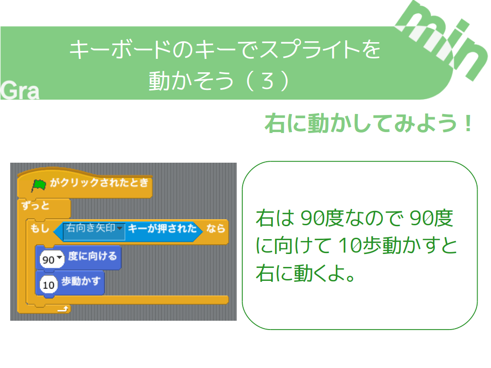

+++
draft = false
showonlyimage = false

image = "img/ref-move-sprite-on-key.png"
date = "2016-11-05T18:25:22+05:30"
title = "キーボードのキーでスプライトを動かそう"

weight = 1
archives = ["2016/11"]
tags = [
  "Scratch",
  "作り方",
]
+++
小学校におじゃました時やオンラインスクラッチクラスで授業をするときに使う資料（しりょう）です。

キーボードのキーでスプライトを動かす方法をまとめました。
<!--more-->

### pdf 形式
[キーを押してスプライトを動かそう.pdf](https://github.com/gramin-programming/kids-programming-resource/blob/master/%E3%82%B9%E3%82%AF%E3%83%A9%E3%83%83%E3%83%81%E3%82%AF%E3%83%A9%E3%83%95%E3%82%99/%E3%83%92%E3%83%B3%E3%83%88/%E3%82%AD%E3%83%BC%E3%82%92%E6%8A%BC%E3%81%97%E3%81%A6%E3%82%B9%E3%83%95%E3%82%9A%E3%83%A9%E3%82%A4%E3%83%88%E3%82%92%E5%8B%95%E3%81%8B%E3%81%9D%E3%81%86.pdf)

### odp 形式
[キーを押してスプライトを動かそう.odp](https://github.com/gramin-programming/kids-programming-resource/blob/master/%E3%82%B9%E3%82%AF%E3%83%A9%E3%83%83%E3%83%81%E3%82%AF%E3%83%A9%E3%83%95%E3%82%99/%E3%83%92%E3%83%B3%E3%83%88/%E3%82%AD%E3%83%BC%E3%82%92%E6%8A%BC%E3%81%97%E3%81%A6%E3%82%B9%E3%83%95%E3%82%9A%E3%83%A9%E3%82%A4%E3%83%88%E3%82%92%E5%8B%95%E3%81%8B%E3%81%9D%E3%81%86.odp)

### ライセンス

[BY ND について](https://creativecommons.org/licenses/by-nd/4.0/deed.ja)
