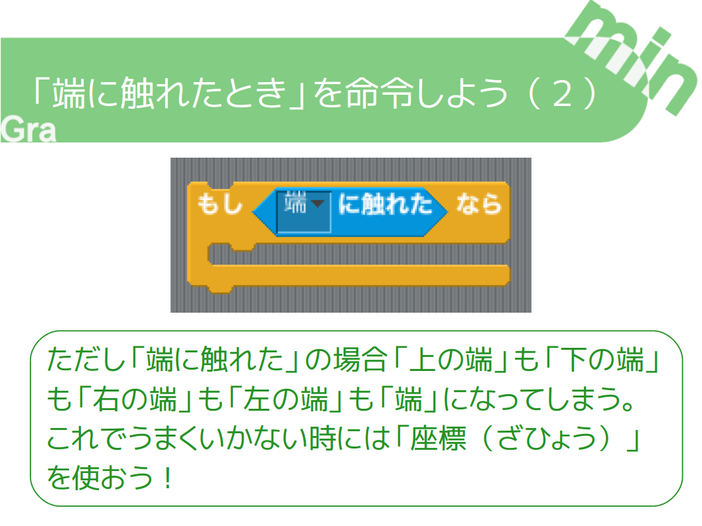

+++
draft = false
showonlyimage = false

image = "img/ref-touch-edge.png"
date = "2016-11-05T18:25:22+05:30"
title = "「端に触れたとき」を命令しよう"

weight = 1
archives = ["2016/11"]
tags = [
  "Scratch",
  "作り方",
]
+++
小学校におじゃました時や<a href='https://gramin.jp/online-scratch-class/'>オンラインスクラッチクラス</a>で授業をするときに使う資料（しりょう）です。

「端に触れたとき」を命令する方法をまとめました。
<!--more-->

### pdf 形式
[端に触れたときを命令しよう.pdf](https://github.com/gramin-programming/kids-programming-resource/blob/master/%E3%82%B9%E3%82%AF%E3%83%A9%E3%83%83%E3%83%81%E3%82%AF%E3%83%A9%E3%83%95%E3%82%99/%E3%83%92%E3%83%B3%E3%83%88/%E7%AB%AF%E3%81%AB%E8%A7%A6%E3%82%8C%E3%81%9F%E3%81%A8%E3%81%8D%E3%82%92%E5%91%BD%E4%BB%A4%E3%81%97%E3%82%88%E3%81%86.pdf)

### odp 形式
[端に触れたときを命令しよう.odp](https://github.com/gramin-programming/kids-programming-resource/blob/master/%E3%82%B9%E3%82%AF%E3%83%A9%E3%83%83%E3%83%81%E3%82%AF%E3%83%A9%E3%83%95%E3%82%99/%E3%83%92%E3%83%B3%E3%83%88/%E7%AB%AF%E3%81%AB%E8%A7%A6%E3%82%8C%E3%81%9F%E3%81%A8%E3%81%8D%E3%82%92%E5%91%BD%E4%BB%A4%E3%81%97%E3%82%88%E3%81%86.odp)

### ライセンス

[BY ND について](https://creativecommons.org/licenses/by-nd/4.0/deed.ja)
