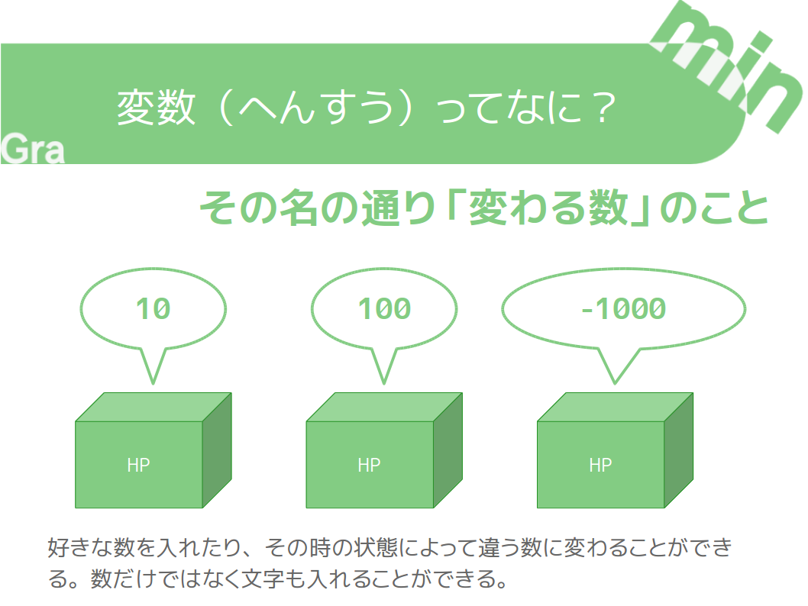

+++
draft = false
showonlyimage = false

image = "img/ref-variable.png"
date = "2016-11-05T18:25:22+05:30"
title = "変数（へんすう）を使ってみよう"

weight = 1
archives = ["2016/11"]
tags = [
  "Scratch",
  "作り方",
]
+++
小学校におじゃました時やオンラインスクラッチクラスで授業をするときに使う資料（しりょう）です。

Scratch で HP（ヒットポイント）を作る時などに使える変数（へんすう）について説明しました。
<!--more-->

### pdf 形式
[変数を使ってみよう.pdf](https://github.com/gramin-programming/kids-programming-resource/blob/master/%E3%82%B9%E3%82%AF%E3%83%A9%E3%83%83%E3%83%81%E3%82%AF%E3%83%A9%E3%83%95%E3%82%99/%E3%83%92%E3%83%B3%E3%83%88/%E5%A4%89%E6%95%B0%E3%82%92%E4%BD%BF%E3%81%A3%E3%81%A6%E3%81%BF%E3%82%88%E3%81%86.pdf)

### odp 形式
[変数を使ってみよう.odp](https://github.com/gramin-programming/kids-programming-resource/blob/master/%E3%82%B9%E3%82%AF%E3%83%A9%E3%83%83%E3%83%81%E3%82%AF%E3%83%A9%E3%83%95%E3%82%99/%E3%83%92%E3%83%B3%E3%83%88/%E5%A4%89%E6%95%B0%E3%82%92%E4%BD%BF%E3%81%A3%E3%81%A6%E3%81%BF%E3%82%88%E3%81%86.odp)

### ライセンス

[BY ND について](https://creativecommons.org/licenses/by-nd/4.0/deed.ja)
