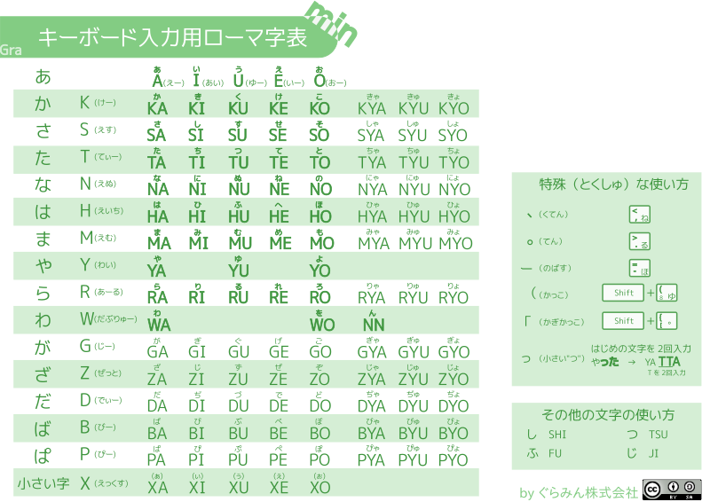

+++
draft = false
showonlyimage = false

image = "img/キーボード入力用ローマ字表.png"
date = "2016-11-05T18:25:22+05:30"
title = "キーボード入力ローマ字表"

weight = 1
archives = ["2016/11"]
tags = [
  "キーボード",
]
+++
<a href='https://gramin.jp'>ぐらみん</a> で使っているキーボード入力をする為のローマ字表です。よく使う文字は太字にして全てキーボードと同じように大文字にしています。
<!--more-->

### pdf 形式
[キーボード入力ローマ字表.pdf](https://github.com/gramin-programming/kids-programming-resource/blob/master/%E3%82%AD%E3%83%BC%E3%83%9B%E3%82%99%E3%83%BC%E3%83%88%E3%82%99%E5%85%A5%E5%8A%9B%E7%94%A8%E3%83%AD%E3%83%BC%E3%83%9E%E5%AD%97%E8%A1%A8.pdf "キーボード入力用ローマ字表.pdf")

### svg 形式

[キーボード入力ローマ字表.svg](https://github.com/gramin-programming/kids-programming-resource/blob/master/%E3%82%AD%E3%83%BC%E3%83%9B%E3%82%99%E3%83%BC%E3%83%88%E3%82%99%E5%85%A5%E5%8A%9B%E7%94%A8%E3%83%AD%E3%83%BC%E3%83%9E%E5%AD%97%E8%A1%A8.svg "キーボード入力用ローマ字表.svg")

### ライセンス

[BY SA について](https://creativecommons.org/licenses/by-sa/4.0/deed.ja)
