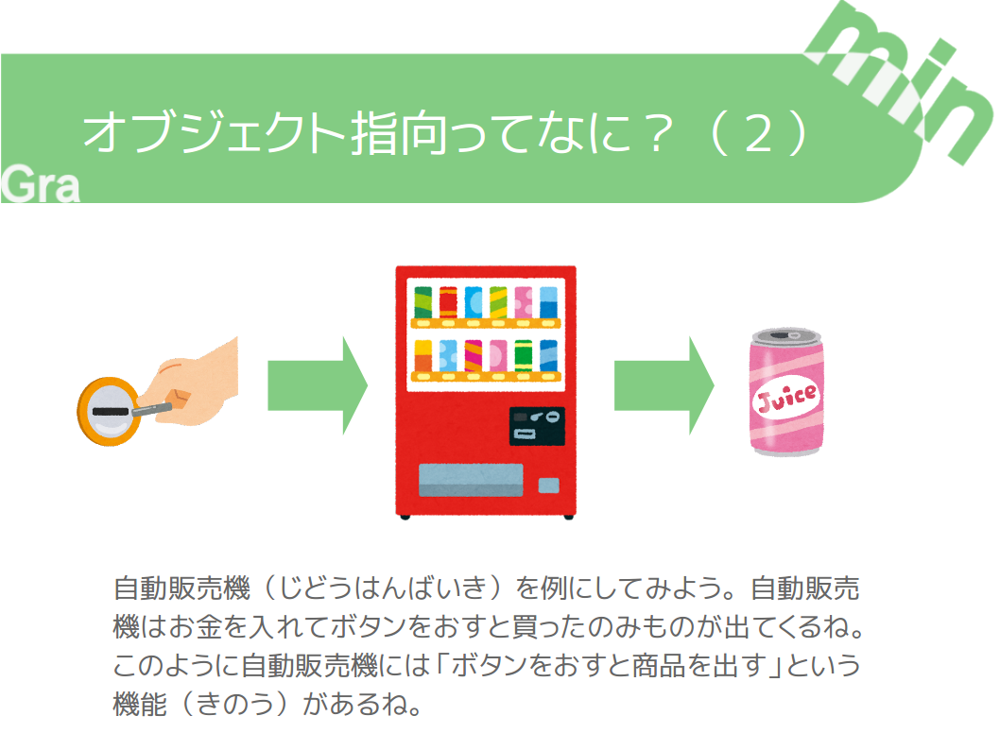

+++
draft = false
showonlyimage = false

image = "img/オブジェクト指向って何？.png"
date = "2016-11-05T18:25:22+05:30"
title = "オブジェクト指向って何？"

weight = 1
archives = ["2016/11"]
tags = [
  "オブジェクト指向",
]
+++
<a href='https://gramin.jp/online-scratch-class/'>オンラインスクラッチクラス</a>で作成した資料です。<a href='https://scratch.mit.edu/'>Scratch</a> がもともとオブジェクト指向を意識しており、その考え方の説明するために作成しました。
<!--more-->

### pdf 形式
[オブジェクト指向って何？.pdf](https://github.com/gramin-programming/kids-programming-resource/blob/master/%E3%82%AA%E3%83%95%E3%82%99%E3%82%B7%E3%82%99%E3%82%A7%E3%82%AF%E3%83%88%E6%8C%87%E5%90%91%E3%81%A3%E3%81%A6%E4%BD%95%EF%BC%9F.pdf "オブジェクト指向って何？.pdf")

### odp 形式

[オブジェクト指向って何？.odp](https://github.com/gramin-programming/kids-programming-resource/blob/master/%E3%82%AA%E3%83%95%E3%82%99%E3%82%B7%E3%82%99%E3%82%A7%E3%82%AF%E3%83%88%E6%8C%87%E5%90%91%E3%81%A3%E3%81%A6%E4%BD%95%EF%BC%9F.odp "オブジェクト指向って何？.odp")

### ライセンス

[BY SA について](https://creativecommons.org/licenses/by-sa/4.0/deed.ja)
